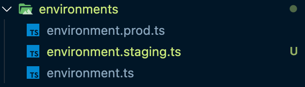
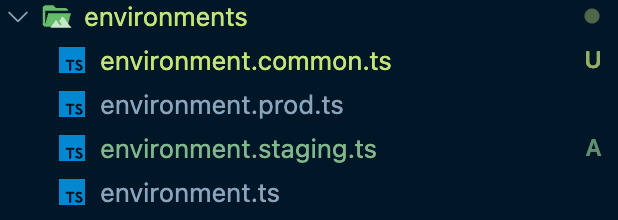

# Using shared settings between multiple environments in Angular 🚀

## The problem 😕

When we create a new Angular project, by default Angular CLI creates two environment files for `development` and `production`.

But in real world software development workflow, we may need more custom environments. Moreover, there are some environmental variables that are common between these environments. For example, API URL to fetch data from server.

In this article, we are going to learn:

- How to add custom environments (e.g. `staging`)
- How we can share some common variables between environments

## Create a custom environment 💎

Open your Angular project and create a new file under `environments` folder. In this example, we create a new environment for staging (`environment.staging.ts` file).

> 🔖 **TIP:** The name of the file should follow the naming convention:
>
> `environment.<your-env-name>.ts`



Great, let's add some configuration in our new env file...

```ts
// environment.staging.ts

export const environment = {
  production: true,
  environmentName: "staging",
  apiUrl: "<your-api-url-here>",
};
```

## Update `angular.json` config file 👈

Once you have created the new environment file, you have to specify file replacements for different environments. In your `angular.json` file find the following paths:

- `projects.<your-project-name>.architect.build.configurations`
- `projects.<your-project-name>.architect.serve.configurations`

Update the sections as the following example:

```json
// angular.json

{
  "$schema": "./node_modules/@angular/cli/lib/config/schema.json",
  "version": 1,
  "newProjectRoot": "projects",
  "projects": {
    "<your-project-name>": {
      // ...

      "architect": {
        "build": {
          //...
          "configurations": {
            //...
            "staging": {
              "fileReplacements": [
                {
                  "replace": "src/environments/environment.ts",
                  "with": "src/environments/environment.staging.ts"
                }
              ]
            }
          }
        },
        "serve": {
          //...
          "configurations": {
            "staging": {
              "browserTarget": "<your-project-name>:build:staging"
            }
          }
        }
      }
    }
  }
}
```

## The problem is still out there 💥

Although we have created a new custom environment, in a typical project setup we may have duplication of environmental settings in which the values may be shared between them.

An example is depicted below where the API URL is common for all environments:

```ts
// environment.ts

export const environment = {
  production: false,
  environmentName: "development",
  apiUrl: "https://my-api.com/api", // common setting
};
```

```ts
// environment.prod.ts

export const environment = {
  production: true,
  environmentName: "production",
  apiUrl: "https://my-api.com/api", // common setting
};
```

```ts
// environment.staging.ts

export const environment = {
  production: true,
  environmentName: "staging",
  apiUrl: "https://my-api.com/api", // common setting
};
```

> ❗ **Attention**
>
> In this example, the common settings is not a real problem, since there is only one shared value between the existing environments.
>
> But... Imagine a real world Angular project which has at least 4-5 environments and a bunch of settings that developers have to maintain. This is really a problem, believe me... 😟😥

## Create a common environment 💦🔥

Let’s make our life easy by using a base configuration file for common settings across all environments.

First, in your project create a new file with name `environment.common.ts` under the `environments` folder.



The next step is to add all base configuration in there...

```ts
// environment.common.ts

export const commonEnv = {
  production: false,
  environmentName: "development",
  apiUrl: "https://my-api.com/api",
};
```

Last step is to change the existing environment files by importing the common file and override only the necessary settings.

In this example we don't need to override anything for the default environment (`development`).

```ts
// environment.ts

import { commonEnv } from "./environment.common";

const env: Partial<typeof commonEnv> = {};

// Export all settings of common replaced by dev options
export const environment = Object.assign(commonEnv, env);
```

But, for `production` and `staging` we have to override some settings from the base.

```ts
// environment.prod.ts

import { commonEnv } from "./environment.common";

const env: Partial<typeof commonEnv> = {
  production: true,
  environmentName: "production",
};

// Export all settings of common replaced by dev options
export const environment = Object.assign(commonEnv, env);
```

```ts
// environment.staging.ts

import { commonEnv } from "./environment.common";

const env: Partial<typeof commonEnv> = {
  production: true,
  environmentName: "staging",
};

// Export all settings of common replaced by dev options
export const environment = Object.assign(commonEnv, env);
```

We use the `Object.assign()` method that allows you to copy all enumerable own properties from one or more source objects to a target object, and return the target object.

> 🔖 **Advanced Tip**
>
> Instead of `Object.assign()` method, you can use the spread operator.
>
> ```ts
> export const environment = { ...commonEnv, ...env };
> ```
>
> As an alternative, if you have more advanced setting with nested properties, I recommend to use `merge` function from [lodash](https://lodash.com/) library.
>
> ```ts
> export const environment = _.merge(commonEnv, env);
> ```

There is one more extremely useful trick here to preserve typings with typescript.
We use `Partial<typeof commonEnv>` in order to help us to track the properties of the common environment and override them correctly.

## Use environment settings inside project

Great! We have created multiple environments and now is time to use them in our project.

You can import environment settings in your services/components like the following example:

```ts
import { Component } from "@angular/core";
import { environment } from "src/environments/environment"; // here is the import

@Component({
  selector: "app-root",
  templateUrl: "./app.component.html",
  styleUrls: ["./app.component.css"],
})
export class AppComponent {
  private apiUrl: string;

  constructor() {
    this.apiUrl = environment.apiUrl;
    // ...
  }
}
```

Please be careful! **Don't import** your settings from the direct environment file!

For example:

```ts
// DO NOT
import { environment } from "src/environments/environment.staging";

// DO
import { environment } from "src/environments/environment";
```

> 🔖 **Advanced Tip**
>
> We saw how to import environment settings in our project...
> But you should NOT import them directly at your components or services.
>
> I suggest to create a new Angular service (e.g. `ConfigService`) and handle all settings from there by injecting it in your components.
> Thus, you will have cleaner and more maintainable code.

## Run/Build your project

TODO

## Conclusion

TODO

<!--
Useful Links:
https://balramchavan.medium.com/configure-and-build-angular-application-for-different-environments-7e94a3c0af23
https://medium.com/@onlyyprasanth/how-to-manage-multiple-environments-with-angular-cli-angular-2-to-5-aa68d557fa77

https://gist.github.com/rxaviers/7360908 -->
