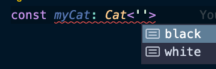
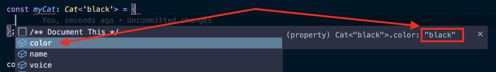

# Generic CRUD Service in Angular: Part 1 - Understanding Generics

<sup>_Cover Photo by [Eugenio Mazzone](https://unsplash.com/@eugi1492?utm_source=unsplash&utm_medium=referral&utm_content=creditCopyText) on [Unsplash](https://unsplash.com/)._</sup>

This article is a part of a series about how to create **Generic CRUD Service & Models in Angular**:

- :point_right: **Part 1 - Understanding Generics**
- [Part 2 - What is CRUD?](https://dev.to/nikosanif/generic-crud-service-in-angular-part-2-what-is-crud-30ek)
- [Part 3 - Generic CRUD Model](https://dev.to/nikosanif/generic-crud-service-in-angular-part-3-generic-crud-model-2hl)
- Part 4 - Generic CRUD Service in Angular _(coming soon...)_

## Introduction

In this series of articles, we are going to learn how to create generic models and services step-by-step regarding the CRUD feature of resources in Angular.

In a nutshell, we're going to learn:

- How to use generics in Typescript
- What is CRUD operations in APIs
- How to create generic models in Angular
- How to create generic service for CRUD in Angular

## The Problem :thinking:

One of the most important principles in programming is the "Don't-Repeat-Yourself" (**DRY**) principle when it comes to writing dynamic and reusable code. We encounter this problem in the main functions provided by the models in real world applications. More specifically, when we are dealing with API endpoints a model can either be created, read, updated or deleted.

For example, let's say that we have two models in our app, "article" and "author". When we are faced with implementing the basics methods requesting the server's API for both models, we are must implement the same functionality twice. Thankfully, Typescript supports generics and allow us avoid code duplications.

## Understanding Generics

First things first! Before we start to analyze our main content, we must understand how does generics work in Typescript and the definition of CRUD in APIs ([Part 2](https://dev.to/nikosanif/generic-crud-service-in-angular-part-2-what-is-crud-30ek)).

Generics are awesome! It allows us to keep our code clean and reusable avoiding duplications. I believe that whoever has used it with Typescript, loves it. The rest of you will love it after this article :laughing:.

### :arrow_right: Example 1 - Type-Safe Generics

The first example that we will see, presents a method where it takes as arguments 2 parameters and returns an object based on them. It is a very simple method but with powerful types.

As you can see below, we use `T` and `U` as generic types which enforces both arguments and returned type to be the same type.
If we pass as first argument a value of type `string`, we are able to know that the property `value1` of the result will be `string` as well. Maybe it looks like a little bit dummy but imagine a real world example (e.g. the main topic of this article - generic CRUD service).

Furthermore, if we look closer the following example, we can predefine the returned object by adding `objectify<string, number>(...)`. Thus, we enforce the first argument to be of type `string` and the second of type `number`. If we try to pass a different type (e.g boolean), then we'll have a type error.

```ts
function objectify<T, U>(value1: T, value2: U): { value1: T; value2: U } {
  return { value1, value2 };
}

// ✅ - Correct
const obj1 = objectify<string, number>('Hello World', 10);
const obj2 = objectify<number, boolean>(10, true);

console.log(obj1); // Output: { value1: "Hello World", value2: 10 }
console.log(obj2); // Output: { value1: 10, value2: true }

// ❌ - Wrong
const obj3 = objectify<string, number>(10, 10);
const obj4 = objectify<string, number>(10, 'Hello World');
```

### :arrow_right: Example 2 - Generic Classes

The second example concerns `class`-es. Yes, classes! Generics work not only with functions but for `class`, `interface`, even `type`. In this example, we will create a custom class implementing a simple functionality of array. It can be initialized by a given array of items, add new item, and get all items.

We use `T` as generic type to declare the type of the stored items in our custom class. Thus, we ensure that all items will be the same type. For example, if we add the following `new MyCustomArray<number>()`, we restrict our instance to accept only values of type `number` at `addItem()` method. Also, we can infer that the `getItems()` method will return a list of values of type `number`.

```ts
class MyCustomArray<T> {
  private items: T[];

  constructor(initialItems: T[]) {
    this.items = initialItems;
  }

  getItems(): T[] {
    return this.items;
  }

  addItem(item: T) {
    this.items.push(item);
  }
}

// ✅ - Correct
const instance1 = new MyCustomArray<number>([1, 2]);
instance1.addItem(3);

const instance2 = new MyCustomArray<string>(['foo']);
instance2.addItem('bar');

console.log(instance1.getItems()); // Output: [1, 2, 3]
console.log(instance2.getItems()); // Output: ["foo", "bar"]

// ❌ - Wrong
instance1.addItem(true);
instance2.addItem(4);
```

### :arrow_right: Example 3 - Generic Constraints

In our third example, we'll learn how to add constraints at generic types. Bellow you will find a method that echoes a value, it accepts an argument and returns it as is. But the main difference is that the value must be either of type `string` or `number`. We use `T` generic type and we extend it to be `string | number`.

Thus, if we try to write something like `echo<boolean>(true)`, Typescript will throw a type error. This functionality is very useful because sometimes our implementation requires specific criteria and we can limit the accepted values.

```ts
function echo<T extends string | number>(value: T): T {
  return value;
}

// ✅ - Correct
const result1 = echo<string>('Hello World');
const result2 = echo<number>(10);

console.log(result1); // Output: Hello World
console.log(result2); // Output: 10

// ❌ - Wrong
const result3 = echo<number>('Foo');
const result4 = echo<boolean>(true);
```

### :arrow_right: Example 4 - Bonus

We have succeeded so far! Let's see a bonus example in action with VSCode!

Let's create an `Animal` interface that can be extended by a `Cat`. But, the `Cat` can only have 2 colors - white or black (no grey zone here :laughing:).

```ts
interface Animal {
  name: string;
  voice: string;
}

interface Cat<T extends 'black' | 'white'> extends Animal {
  color: T;
}
```

When we are trying to create an object of type `Cat`, the editor will help us by suggesting us only the 2 main colors. You can see the picture below:



Now, let's create a black cat (I hope this does not mean bad luck for this article :sweat:). As you can see, we have set the generic type to `black` with `Cat<'black'>` and the editor give us as the only option to set `color: 'black'`.



Final model:

```ts
const myCat: Cat<'black'> = {
  color: 'black',
  name: 'Kitty',
  voice: 'meow',
};
```

Now let's forget cats and see a real world example... The following code is about how to apply generics at `type`. We have created a type that enforces an array to have a least one item.

We used `T[]` generic type which tell us that the type is an array of items and `{ 0: T }` which indicates that the first item will not be empty. As you already noticed we have used the `&` operator that will enforce the `NonEmptyArray` type to fulfill both cases.

```ts
export type NonEmptyArray<T> = T[] & { 0: T };

function getFirstItemOfArray(items: NonEmptyArray<T>): T {
  return items[0];
}

// ✅ - Correct
const first1 = getFirstItemOfArray([1, 2]);

// ❌ - Wrong
const first2 = getFirstItemOfArray([]);
const first3 = getFirstItemOfArray(null);
```

## What's next?

- [**Part 2 - What is CRUD?**](https://dev.to/nikosanif/generic-crud-service-in-angular-part-2-what-is-crud-30ek)

## References

- [Typescript Generics](https://www.typescriptlang.org/docs/handbook/2/generics.html)
- [How To Use Generics in TypeScript](https://www.digitalocean.com/community/tutorials/typescript-generics-in-typescript)

Author: Nikos Anifantis ✍️

[](https://twitter.com/nikosanif) [](https://www.linkedin.com/in/nikosanifantis/)
