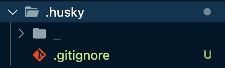
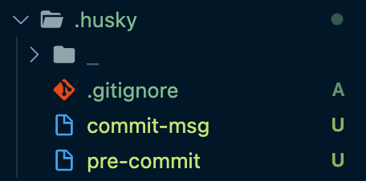
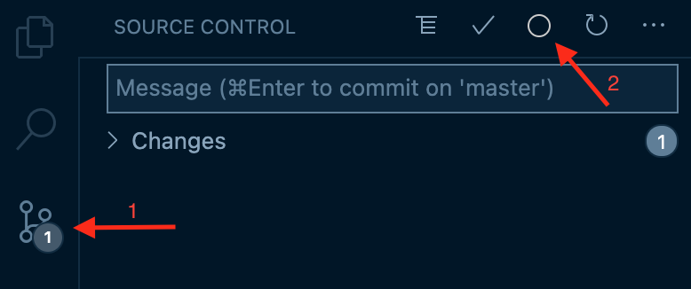

# Awesome Dev Tools for Node.js Repositories :fire:

## Introduction

TODO

- **[Prettier](https://prettier.io/)** constitutes an opinionated code formatter which supports many languages and integrations with most code editors. It allow us to format automatically our code on save saving time and making sure our code have only one, unique and clean format style.

- **[Conventional Commits](https://www.conventionalcommits.org/en/v1.0.0/)** is a lightweight convention on top of commit messages, providing an easy set of rules for creating an explicit commit history; which makes it easier to write automated tools on top of.

  ```
  <type>[optional scope]: <description>

  [optional body]

  [optional footer]
  ```

- **[Husky](https://github.com/typicode/husky#readme)** is a library that allows us to run specific commands and scripts at time of committing and pushing our code using [Git hooks](https://git-scm.com/book/en/v2/Customizing-Git-Git-Hooks).

- **[Standard Version](https://github.com/conventional-changelog/standard-version#readme)** is a utility library for versioning using [semver](https://semver.org/) and CHANGELOG generation based on conventional commits of your repository.

In this tutorial, we will also use [commitlint](https://github.com/conventional-changelog/commitlint) and [pretty-quick](https://github.com/azz/pretty-quick#readme) libs to check if your commit messages meet the conventional commit format and run prettier on changed files respectively.

## Install Prettier :hibiscus:

First of all we are going to install Prettier in our the project.

```sh
$ npm i -D prettier
```

Now let's add some configuration files that specify rules and ignore files from prettier formatting.

In your project at root directory create two files with names `.prettierrc` and `.prettierignore`.

```sh
# .prettierrc

{
  "useTabs": false,
  "printWidth": 80,
  "tabWidth": 2,
  "singleQuote": true,
  "trailingComma": "all",
  "semi": true
}
```

```sh
# .prettierignore

/dist
/coverage
```

Last step is to install Prettier extension at VS Code. Open "Quick Open" (`CMD`/`CTRL` + `P`), paste the following command, and press enter.

```sh
ext install esbenp.prettier-vscode
```

Great, now try to write some code (without :bug: :laughing:), save your file and let the magic begin!

## Install Husky :dog2:

First, to install Husky in your project, you have to run the following command:

```sh
$ npm i -D husky
```

Then, run the command below in order to initialize the configuration files.

```sh
$ npx husky install
```

It will generate a new folder at root directory as depicted below:



In order to ensure that husky is going to be initialized each time that you install your project, add the following `postinstall` script at your `package.json` file.

```json
// package.json

{
  "name": "awesome-project",
  "version": "0.0.0",
  "scripts": {
    "postinstall": "husky install"
    // ...
  }
  // ...
}
```

## Setup Git Hooks :twisted_rightwards_arrows:

Awesome, you made it so far! Let's combine them together and setup our project. :smirk:

It's time to add some scripts for:

- commit message validation that meet conventional commit format
- format with prettier the changed files before committing new code

Install all the required dev-dependencies, by running:

```sh
$ npm i -D @commitlint/cli @commitlint/config-conventional pretty-quick
```

Open your project and create a new file with name `commitlint.config.js` under the root folder. Then copy/paste commitlint configuration in your new file as depicted below.

```js
// commitlint.config.js

module.exports = {
  extends: ["@commitlint/config-conventional"],
};
```

The next step is to tell Husky what command to execute on which Git Hook action. Create two files under the `.husky` folder with names `commit-msg` and `pre-commit`.



In order to validate commit messages on commit-msg Git Hook, we use **commitlint** command. This action allows us to verify if the new commit message meets the requirements of Conventional Commits specification.

If the commit message does not follow the rules, it will not allow us to commit our new code.

```sh
# commit-msg

#!/bin/sh
. "$(dirname "$0")/_/husky.sh"

npx --no-install commitlint --edit $1
```

The second action that we want to achieve is to format our code automatically before we commit our code to the repository. We use **pretty-quick** command to format our code depending on the defined configuration that we have specified.

Also, we use `--staged` command flag to format only those files that are changed in our new commit.

```sh
# pre-commit

#!/bin/sh
. "$(dirname "$0")/_/husky.sh"

npx --no-install pretty-quick --staged
```

**_[Optional]_** As final step, I recommend to install the Conventional Commits official plugin in your VS Code. It will help you to write structured commit messages through a step-by-step form without having to memorize all the rules.

Open "Quick Open" (`CMD`/`CTRL` + `P`), paste the following command, and press enter.

```
ext install vivaxy.vscode-conventional-commits
```

Once you have installed the plugin, open "Source Control" panel and click on the "circle" icon button at the top. A panel will appear and will guide you to write your commit message.



> 🔖 **Tip**
>
> Although it may seem like a tedious process at first, it will help a lot and over time you will get used to it very easily writing well structured commit messages. :wink:

## Install Standard Version :package:

```sh
$ npm i -D standard-version
```

```json
// package.json

{
  "name": "awesome-project",
  "version": "0.0.0",
  "scripts": {
    // ...
    "release": "standard-version --release-as major",
    "release:minor": "standard-version --release-as minor",
    "release:patch": "standard-version --release-as patch"
  }
  // ...
}
```

```sh
$ npm run release -- --dry-run
```

```sh
✔ bumping version in package.json from 0.0.0 to 1.0.0
✔ bumping version in package-lock.json from 0.0.0 to 1.0.0
✔ outputting changes to CHANGELOG.md

---
# ... changelog here
---

✔ committing package-lock.json and package.json and CHANGELOG.md
✔ tagging release v1.0.0
ℹ Run `git push --follow-tags origin master` to publish
```

## Conclusion :white_check_mark:
